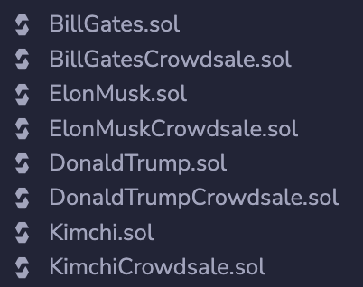
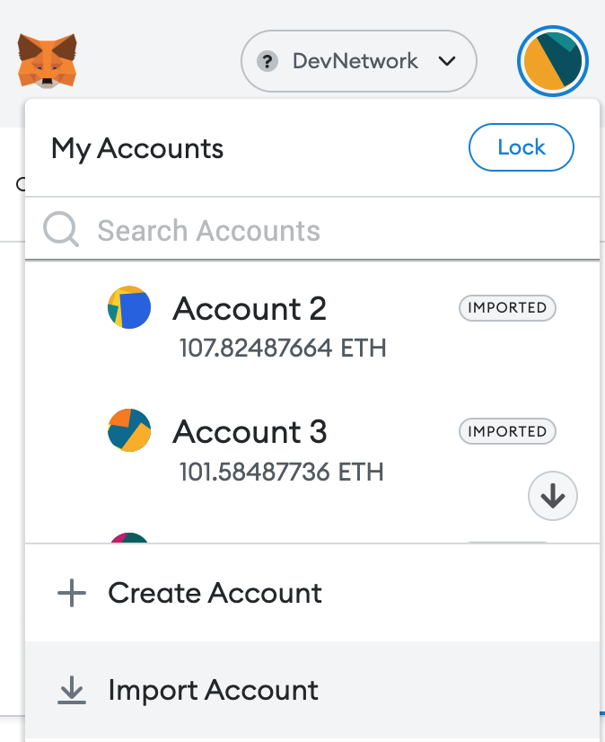
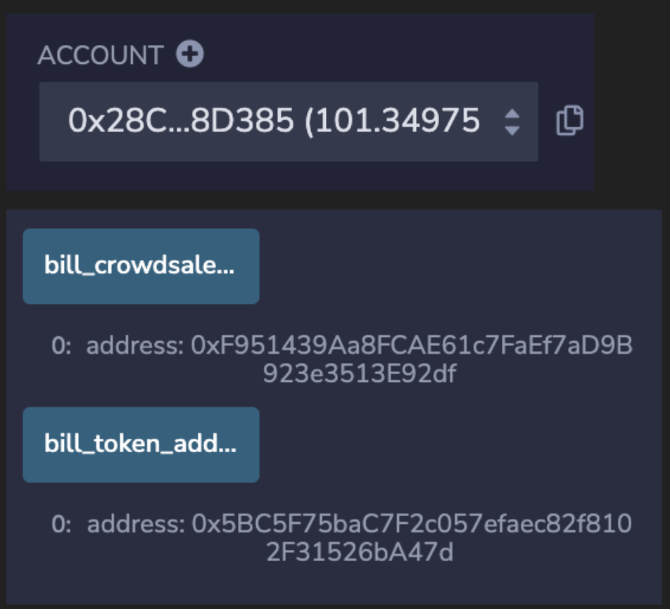
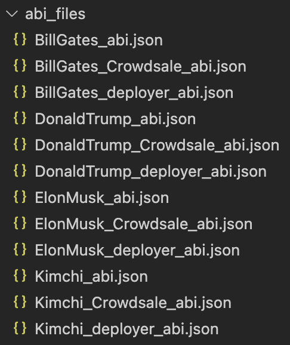
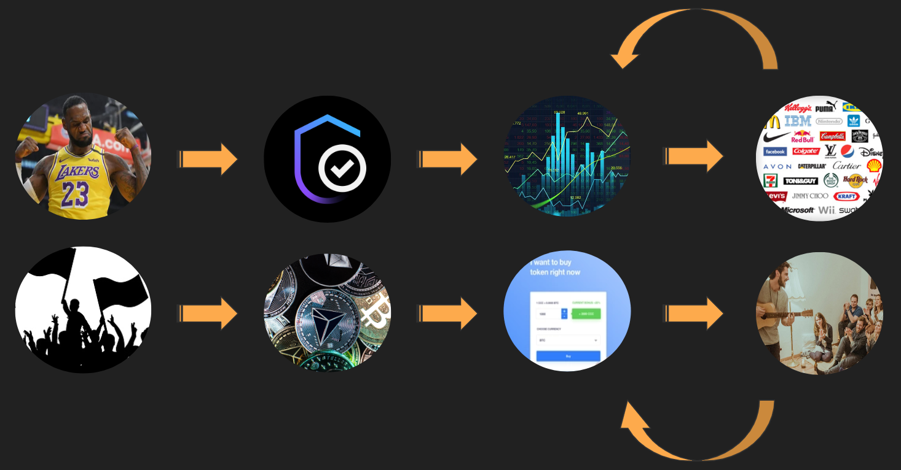
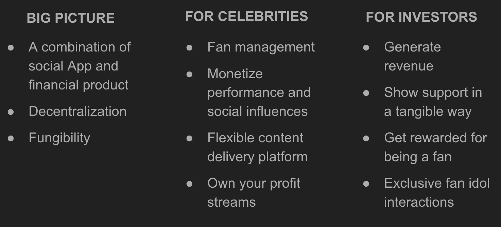
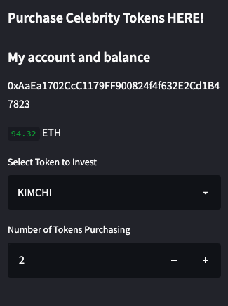
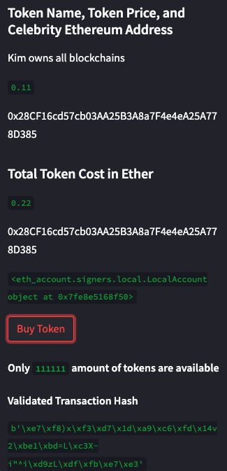

# FinaticFi 2.0
**FinaticFi 2.0** is a blockchain platform that allows public figures to create their customized tokens, which enables them to generate revenue based on their public image/performance/likeness, etc. It also allows ‘Fanatics’ (investors/fans) to pocket profit by trading tokens as its value increases.
---

# **Link to the web application** click [here](http://localhost:8501)


**OVERVIEW:**

* [Technologies](#technologies)

* [App Development](#app-development)

* [Usage Descriptions](#usage-descriptions)

* [Competitive Advantages](#competitive-advantages)

* [App Demo](#app-demo)

* [FanaticFi 3.0 Plans](#fanaticfi-30-plans)

* [Contributors](#contributors)

---

## Technologies
>This project leverages python 3.7

* [Streamlit](https://streamlit.io/) - Deploy application into shareable web app

* [Solidity](https://docs.soliditylang.org/en/v0.8.15/) - object-oriented, high-level language for implementing smart contracts

* [Remix IDE](https://remix.ethereum.org/) - allows developing, deploying and administering smart contracts for Ethereum like blockchains. It can also be used as a learning platform

* [OpenZeppelin](https://www.openzeppelin.com/) - provides seurity products to build, automate, and operate decentralized applications.

* [Ganache](https://trufflesuite.com/ganache/) - A personal Ethereum blockchain for test, inspect, and operate blockchain transactions

* [Metamask](https://metamask.io/) - A crypto wallet to interact with blockchain

```python
pip install web3==5.17
pip install eth-tester==0.5.0b3
pip install mnemonic
pip install bip44
```

---

## App Development
**Solidity Smart Contracts:**
* Celebrity token contracts
* Celebrity crowdsale contracts



**Ganache & Metamask setup:**
* Save Mnemonic phrases to .env file
* Import accounts to Metamask
* Deploy each contract (celebrity account) using Remix - Metamask link under different account
* Deploy related crowdsale and token contracts with provided addresses



**Contract addresses:**
* Contract deployer address
* Contract crowdsale address
* Contract token address



**Contract abi files:**
* Contract deployer abi
* Contract crowdsale abi
* Contract token abi



**Streamlit deployemt:**
* Designs and deploy app application
* Run application on command line at file directory

```python
streamlit run fanaticfi.py
```

---

## Usage Descriptions



---

## Competitive Advantages



---

## App Demo






---

## FanaticFi 3.0 Plans

* Develop functionality for celebrities to generate their own accounts on the webpage (without us having to do it manually)

* Develop functionality for celebrities to “cash out” on their raised crowdsale funds

* Create a way to invest and trade in each token to reflect the changing supply, demand, and price fluctuations users are willing to pay  
    * Additionally, would create various funds made up of a mix of user’s favorite celebrity tokens that would allow a user to invest in more than one token at a time

* Deploy on a new blockchain rather than Ethereum in order to have better customization, ownership, and price points

---

## Contributors

**Yanjun Lin Andrie** <span>&nbsp;&nbsp;</span> |
<span>&nbsp;&nbsp;</span> email: yanjun.lin.andrie@gmail.com <span>&nbsp;&nbsp;</span>|
<span>&nbsp;&nbsp;</span> [](https://www.linkedin.com/in/yanjun-linked/)

**UC Berkeley Extension**

---

## License

[](LICENSE)
